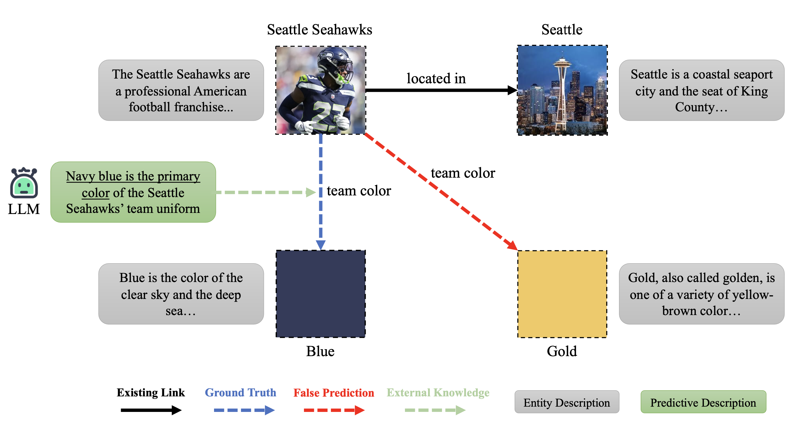

# KERMIT: Knowledge Graph Completion of Enhanced Relation Modeling with Inverse Transformation



## Overview

This repository contains the implementation of the [paper](https://arxiv.org/abs/2309.14770) "KERMIT: Knowledge Graph Completion of Enhanced Relation Modeling with Inverse Transformation". In this paper, we introduce enhanced KGC using LLM-generated knowledge (predictive descriptions and inverse relations) and supervised contrastive learning, achieving significant performance boosts.

## Requirements

- Python 3.7 or above
- Additional dependencies are listed in `requirements.txt`

All experiments are conducted on a machine with 4 Quadro RTX 8000 GPUs.

## Installation

1. Clone this repository

2. Install the required dependencies:

```sh
pip install -r requirements.txt
```

## Data preparation
The link to the datasets can be found in the [Google Drive folder](https://drive.google.com/drive/folders/1mFER0J8TmrtR18VBaKOc6_VYYnjb88uu?usp=sharing).

Download the datasets and extract them to the `data` folder to get the following directory structure:

```
data
├── FB15k237
│   ├── entities.json
│   ├── inverse_relations.json
│   ├── test.json
│   ├── train.json
│   └── valid.json
├── WN18RR
│   ├── entities.json
│   ├── inverse_relations.json
│   ├── test.json
│   ├── train.json
│   └── valid.json
├── umls
│   ├── entities.json
│   ├── inverse_relations.json
│   ├── test.json
│   ├── train.json
│   └── valid.json
```

## Training and evaluation

The scripts to train and evaluate a model on the WN18RR and FB15k-237 datasets are available in the `scripts` folder.

## Acknowledgements
The code is partially borrowed from [SimKGC](https://github.com/intfloat/SimKGC).

## Citation
If you find this work useful, please consider citing:

```
@misc{li2024kermitknowledgegraphcompletion,
      title={KERMIT: Knowledge Graph Completion of Enhanced Relation Modeling with Inverse Transformation}, 
      author={Haotian Li and Bin Yu and Yuliang Wei and Kai Wang and Richard Yi Da Xu and Bailing Wang},
      year={2024},
      eprint={2309.14770},
      archivePrefix={arXiv},
      primaryClass={cs.CL},
      url={https://arxiv.org/abs/2309.14770}, 
}
```
